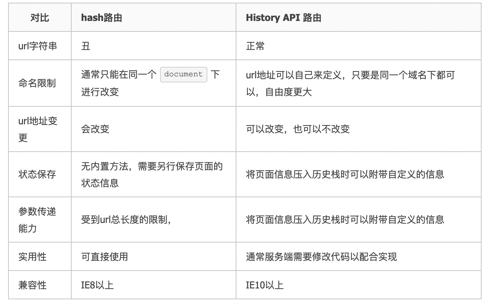

# 路由

## 基本原理

前端路由的实现基本上有两种。

一种是根据 `hashchange` 事件，当发生该事件的时候获取具体的url信息（具体来说是url地址后面多出来的# + 'xxx'的部分）然后渲染相应的组件或元素。

```
当URL的片段标识符更改时，将触发hashchange事件 (跟在＃符号后面的URL部分，包括＃符号)——来自MDN
```

另一种是使用 `History API`，当用户将要跳转下一个页面或者下一个url的时候，调用 `history.pushState()` 方法向历史栈中压入一个新的state，历史栈顶部的指针是指向新的state的。这个时候浏览器的URL是改变了，但是实际上页面并没有刷新，而页面的渲染变化可以由开发中来控制。

具体的API如下：

在HTML4中的API

* history.forward(); //在历史记录中前进一步
* history.back(); //在历史记录中后退一步
* history.go(n): //在历史记录中跳转n步骤，n=0为刷新本页,n=-1为后退一页。

在HTMl5中的API

* history.pushState(data[,title][,url]);//向历史记录中追加一条记录
* history.replaceState(data[,title][,url]);//替换当前页在历史记录中的信息。
* history.state;//是一个属性，可以得到当前页的state信息。
* window.onpopstate;//是一个事件，在点击浏览器后退按钮或js调用forward()、back()、go()时触发。监听函数中可传入一个event对象，event.state即为通过pushState()或replaceState()方法传入的data参数。

由于用户点击了浏览器的前进,回退,或是显式调用HTML4中的操作历史栈的方法会重新刷新页面，所以针对这些情况需要后端配合将请求重定向到同一个页面。

### hash方式 vs History API

;